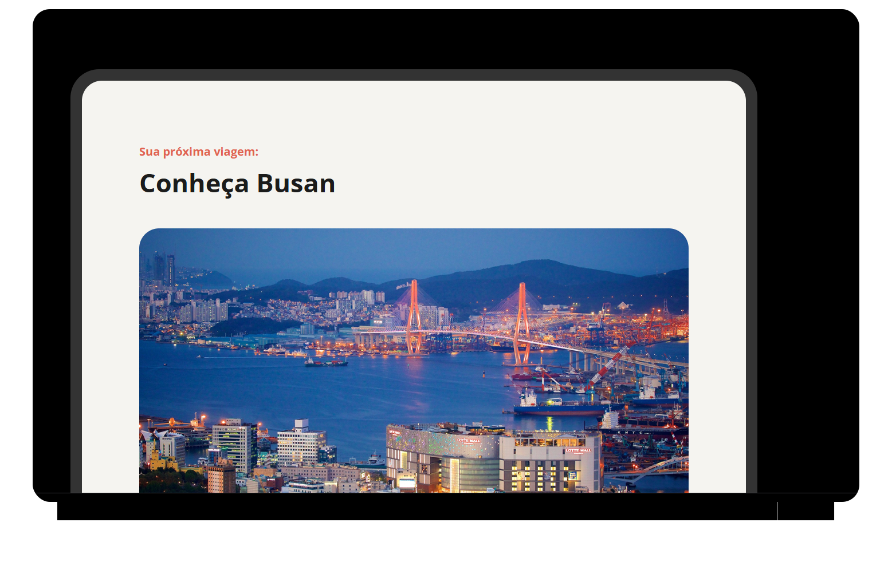

<h1 align="center">
    
    <p>Boas-vindas ao projeto Local turístico!😎✈️</p>
</h1>

<h1>
    
    <p> 
        <h2>Conheça o Projeto</h2> Neste desafio, foi desenvolvido uma Landing Page de turismo utilizando apenas HTML e CSS. A página apresenta informações com destaque para locais turísticos, imagens atrativas e textos descritivos. O objetivo é praticar a estruturação semântica do HTML e o uso de estilos em CSS para criar um layout organizado e visualmente agradável.
    </p>
</h1>

<br>


<br>

## Tabela de Conteúdos

* [Sobre](#-Sobre)
* [Comece por aqui](#-Comece-por-aqui)
* [Tecnologias utilizadas](#-Tecnologias-utilizadas)
* [Pré-requisitos e como rodar a aplicação/testes](#-Pré-requisitos-e-como-rodar-a-aplicação/testes)
* [Rodando o Front End (cliente)](#-Rodando-o-Front-End-(cliente))
* [Licença](#-Licença)
* [Autor](#-Autor)

## 📘 Sobre

Este projeto é uma página web desktop com informações sobre um **local turístico**.
Esse é um dos desafios práticos da formação Fullstack da **Rocketseat**, uma plataforma de especialização e educação em tecnologia e programação do Brasil.

## 🚀 Comece por aqui

- 💻 [Projeto](https://www.figma.com/design/91tibN76EDWZgB9neYLl7y/Local-Tur%C3%ADstico--Community-?node-id=3-376&p=f&t=HN55rPnToyuxL1CK-0)
- 🎨 [Style Guide](https://www.figma.com/design/91tibN76EDWZgB9neYLl7y/Local-Tur%C3%ADstico--Community-?node-id=3-377&p=f&t=HN55rPnToyuxL1CK-0)

## 🧑‍💻 Tecnologias utilizadas

### 🔨 Tecnologias

As seguintes ferramentas foram usadas na construção do projeto:

- [HTML](https://developer.mozilla.org/pt-BR/docs/Web/HTML)
- [CSS](https://developer.mozilla.org/pt-BR/docs/Web/CSS)

## Pré-requisitos e como rodar a aplicação/testes

### 📝 Pré-requisitos

Antes de começar, você vai precisar ter instalado em sua máquina a ferramenta
[Git](https://git-scm.com).
Além disto é bom ter um editor para trabalhar com o código como [VSCode](https://code.visualstudio.com/).

### 🎲 Rodando o Front End (cliente)

```bash
# Clone este repositório
$ git clone <https://github.com/>

# Acesse a pasta do projeto no terminal/cmd
$ cd local-turistico

# Vá para a pasta index.html
$ cd index.html

# Instale no VScode a extensão live server - vá em extenções no canto esquerdo da tela ou tecle no atalho (Ctrl+Shift+X)

# Clique com o botão direito do mouse no arquivo index.html e escolha a opção "Open with Live Server" ou clique no canto inferior direito na opção "Go Live"  

# A maquina local inciará na porta:5500 - acesse <http://127.0.0.1:5500/> no browser
```

## Autor

<a href="">
    
    <br>
    <sub><b>Gabriel Bispo Ribeiro</b></sub></a> <a href="https://app.rocketseat.com.br/me/gabriel-bispo-ribeiro-1595723134" title="Rocketseat">🚀</a>
<br><br>
<p>Feito com ❤️ por Gabriel Bispo Ribeiro 👋 Entre em contato!</p>
<br>

  


## Status do Projeto

<h3 align="center">
	<b>🚧  React Select 🚀 Em construção...  🚧<b>
</h3>

## Licença


